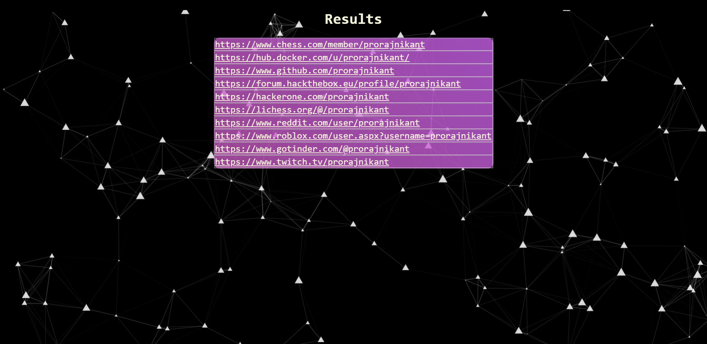

<center>

</center>
 
# LinkTrace - Username Finder

## 📝 Description

LinkTrace is a simple web application used to find out different profiles associated with a username making the process of Open Source Intelligence (OSINT) very easy.

The GUI makes eveything more understandable and aesthetically pleasing.

## 📜 Instructions For Web version

**Step 1)** Visit the URL $$$$$ [www.google.co.in]().

**Step 2)** Just enter the username and click on search.

* Searching usually takes 25-30 seconds but it also depends on your internet speed.
* Once the search is complete, you will be redirected to the results page where all the profiles associated with the entered username will be tabulated.
* Click on a particular link to visit the profile.

## 📜 Instructions For Localhost / CLI Version

**Step 1)** Clone the LinkTrace repo using $$$$$ `git clone https://github.com/prorajnikant/sherlock_test1.git`

**Step 2)** Open a command prompt in the project directory. Enter the command: `pip install -r requirements.txt`

**Step 3)** Move in the 'linktrace' folder using `cd linktrace`

**Step 4)** Run the following 2 commands:

```
set FLASK_APP=linktrace.py

flask run
```

**Step 5)** Open your browser and visit `http://localhost:5000/` You can keep the command prompt open if needed because results will be displayed there too.

**Step 6)** Search for the required username.

## 📷 Screenshots



